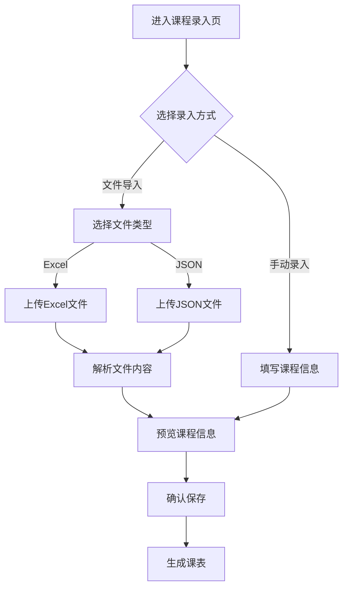
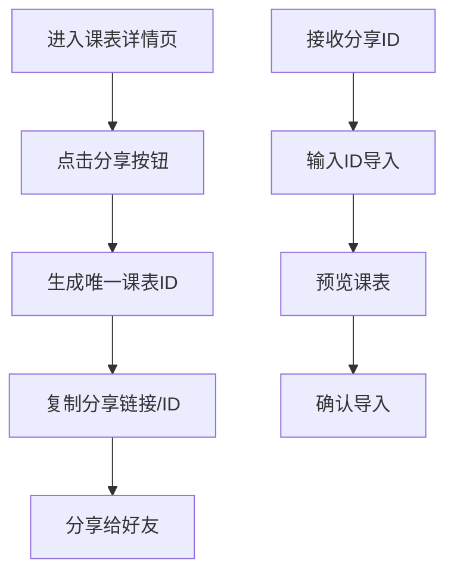

# 智能课程表系统架构设计

## 1. 系统架构概览

### 1.1 技术栈选择
- **前端**：微信小程序原生开发（WXML, WXSS, JavaScript）
- **后端**：微信云开发（CloudBase）
- **数据库**：云数据库（JSON格式）
- **存储**：云存储（用于文件导入/导出、模板文件存储）
- **云函数**：处理复杂业务逻辑、文件解析、课表ID生成等

### 1.2 系统模块划分
1. **课表管理模块**：课程信息录入、可视化展示
2. **共享与社区模块**：课表分享、课表广场
3. **信息完善模块**：信息引导、模板管理
4. **质量评价模块**：热度排行、用户评价
5. **认证验证模块**：官方认证、班级绑定

## 2. 页面结构设计

### 2.1 主要页面
1. **首页**：课表概览、快速入口
2. **课表管理页**：
   - 课程录入子页面（手动录入、文件导入）
   - 课表展示子页面（周视图、日视图）
3. **课表广场页**：共享课表展示、热度排行
4. **课表详情页**：课表详细信息、评价系统
5. **个人中心页**：用户信息、我的课表
6. **认证管理页**：班级绑定、官方认证申请

### 2.2 页面导航结构
```
├── 首页
│   ├── 课表管理页
│   │   ├── 课程录入（手动/文件导入）
│   │   └── 课表展示（周/日视图）
│   ├── 课表广场页
│   │   └── 课表详情页
│   └── 个人中心页
│       └── 认证管理页
```

## 3. 数据库设计

### 3.1 核心数据模型

#### 3.1.1 课程表（timetable）
| 字段名 | 类型 | 描述 | 必选 |
|-------|------|------|------|
| _id | String | 课表ID（唯一标识） | 是 |
| name | String | 课表名称 | 是 |
| creator | String | 创建者ID | 是 |
| createTime | Timestamp | 创建时间 | 是 |
| updateTime | Timestamp | 更新时间 | 是 |
| courses | Array | 课程列表 | 是 |
| shareCount | Number | 被导入次数 | 是 |
| likeCount | Number | 点赞数 | 是 |
| ratingCount | Number | 评价数量 | 是 |
| averageRating | Number | 平均评分 | 是 |
| isOfficial | Boolean | 是否官方认证 | 是 |
| classId | String | 关联班级ID | 否 |
| description | String | 课表描述 | 否 |

#### 3.1.2 课程（courses）
| 字段名 | 类型 | 描述 | 必选 |
|-------|------|------|------|
| _id | String | 课程ID | 是 |
| courseName | String | 课程名称 | 是 |
| teacher | String | 教师姓名 | 否 |
| location | String | 上课地点 | 否 |
| dayOfWeek | Number | 星期几（1-7） | 是 |
| startTime | String | 开始时间 | 是 |
| endTime | String | 结束时间 | 是 |
| weeks | Array | 周次列表 | 是 |
| description | String | 课程简介 | 否 |
| color | String | 课程颜色标识 | 否 |

#### 3.1.3 用户（users）
| 字段名 | 类型 | 描述 | 必选 |
|-------|------|------|------|
| _id | String | 用户ID | 是 |
| nickname | String | 用户昵称 | 是 |
| avatarUrl | String | 头像URL | 是 |
| createTime | Timestamp | 创建时间 | 是 |
| preferences | Object | 用户偏好设置 | 否 |
| managedClasses | Array | 管理的班级ID列表 | 否 |

#### 3.1.4 班级（classes）
| 字段名 | 类型 | 描述 | 必选 |
|-------|------|------|------|
| _id | String | 班级ID | 是 |
| className | String | 班级名称 | 是 |
| managerId | String | 管理员ID | 是 |
| createTime | Timestamp | 创建时间 | 是 |
| officialTimetableId | String | 官方课表ID | 否 |

#### 3.1.5 评价（reviews）
| 字段名 | 类型 | 描述 | 必选 |
|-------|------|------|------|
| _id | String | 评价ID | 是 |
| timetableId | String | 课表ID | 是 |
| userId | String | 用户ID | 是 |
| rating | Number | 评分（1-5） | 是 |
| createTime | Timestamp | 评价时间 | 是 |

## 4. 云函数设计

### 4.1 核心云函数
1. **generateTimetableId**：生成唯一课表ID
2. **parseExcelFile**：解析Excel格式课程文件
3. **parseJsonFile**：解析JSON格式课程文件
4. **importTimetable**：导入课表（通过ID）
5. **calculateRating**：计算课表平均评分
6. **verifyClassManager**：验证班级管理员权限
7. **reportError**：处理课表错误报告

### 4.2 云函数调用流程
```
前端页面 → 云函数调用 → 云数据库操作 → 返回结果
```

## 5. 接口设计

### 5.1 前端调用接口
1. **课表管理**：
   - 创建课表：`wx.cloud.callFunction({name: 'createTimetable'})`
   - 更新课表：`wx.cloud.callFunction({name: 'updateTimetable'})`
   - 获取课表：`wx.cloud.database().collection('timetable').doc(id).get()`

2. **课表共享**：
   - 分享课表：`wx.cloud.callFunction({name: 'shareTimetable'})`
   - 获取课表广场：`wx.cloud.database().collection('timetable').where({isShared: true}).get()`

3. **评价系统**：
   - 点赞课表：`wx.cloud.callFunction({name: 'likeTimetable'})`
   - 评价课表：`wx.cloud.callFunction({name: 'rateTimetable'})`

4. **认证系统**：
   - 申请班级管理员：`wx.cloud.callFunction({name: 'applyClassManager'})`
   - 认证课表：`wx.cloud.callFunction({name: 'verifyTimetable'})`

## 6. 存储设计

### 6.1 云存储结构
```
/cloudstorage
├── templates/          # 模板文件
│   ├── excel_template.xlsx  # Excel导入模板
│   └── json_template.json   # JSON导入模板
├── imports/            # 导入文件临时存储
└── exports/            # 导出文件存储
```

## 7. 系统流程图

### 7.1 课程录入流程


### 7.2 课表分享流程


## 8. 性能优化策略

### 8.1 前端优化
- 使用虚拟列表减少渲染负担
- 本地缓存常用数据
- 图片懒加载
- 页面预加载

### 8.2 后端优化
- 索引优化：为常用查询字段创建索引
- 云函数超时处理
- 批量操作优化
- 错误处理与重试机制

## 9. 安全策略

### 9.1 数据安全
- 敏感数据加密存储
- 权限控制：用户只能操作自己的课表
- 班级管理员权限验证

### 9.2 操作安全
- 防SQL注入（云数据库自动处理）
- 防XSS攻击
- 接口调用频率限制

## 10. 扩展性考虑

### 10.1 功能扩展
- 支持更多文件格式导入（如CSV）
- 增加课程提醒功能
- 集成校园日历

### 10.2 技术扩展
- 支持小程序码扫描分享
- 接入微信支付（未来可能的增值服务）
- 多端适配（如H5版本）

## 11. 开发计划

### 11.1 开发阶段
1. **基础架构搭建**：项目初始化、云开发配置
2. **核心功能开发**：课表管理、数据模型
3. **共享功能开发**：分享机制、课表广场
4. **评价系统开发**：热度排行、用户评价
5. **认证系统开发**：官方认证、班级绑定
6. **测试与优化**：功能测试、性能优化
7. **上线与运营**：发布上线、运营支持

### 11.2 开发周期
预计开发周期：8-10周
- 基础架构：1周
- 核心功能：3周
- 共享功能：1周
- 评价系统：1周
- 认证系统：1周
- 测试与优化：1-2周
- 上线与运营：1周

## 12. 总结

本系统架构设计基于微信云开发技术栈，充分利用了云开发的优势，简化了后端开发流程，同时保证了系统的可扩展性和安全性。系统设计符合需求说明书中的所有功能要求，为后续的开发工作提供了清晰的指导。